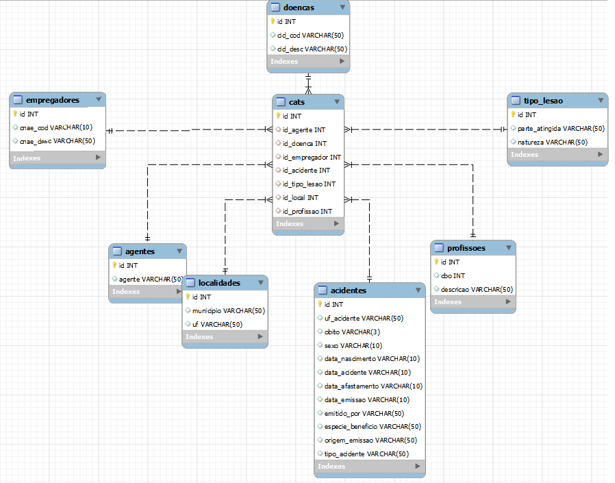

# Este código foi desenvolvido para a criação de um BIG DATA do curso de Técnologo de Banco de dados da PUC MINAS

# Propósito

Atualmente, os arquivos das CATS (comunicações de acidentes de trabalho [tema do trabalho]) disponibilizados pelo INSS no site dados.gov, não seguem um padrão de nomenclatura.
Então, foram coletados todos os padrões já utilizados anteriormente, afim de testa-los em novas datas, possibilitando o download e mantendo assim, nossa base de arquivos sempre atualizada de forma manual.

# O que acontece ao executar o script ?

O código (feito em PHP, JS e Python), monta um array com todos esses padrões, e testa um por um. Caso o link gerado exista, é feito o download do arquivo (há uma variação de funcionamento nas 3 linguagens).
Os arquivos podem ser baixados em formato CSV e ZIP. Quando é identificado que o arquivo é CSV, é feita a verificação da existencia do arquivo, caso não exista é feita a leitura do header do arquivo, e de acordo com a quantidade de colunas, separado por pasta.
Caso o arquivo seja ZIP, também é feita a verificação da existencia do arquivo, a verificação da existencia do arquivo CSV contido no ZIP, e caso não exista, é feita a extração do arquivo e a classificação por pasta.
Ao final do processo, todos os arquivos que não sejam CSV, são deletados dos diretorios.

# O que é feito depois?
Damos inicio em outra etapa do projeto, que é a leitura dos arquivos CSV, em uma ferramenta de integração de dados. Onde é feito o processo de ETL e a criação do banco para armazenamento dos dados.
O banco segue o modelo star schema, sendo composto por 9 tabelas, sendo seis tabelas dimensão, uma tabela fato e uma tabela temporária.
Abaixo o diagrama do banco em questão:

# Descrição dos arquivos:
- ClassDownload.py: 
    - aqui é feito o teste das URLS e o download caso exista, separando os arquivos nas pastas modelo_1 e modelo_2, de acordo com a quantidade de colunas (25 e 24)
    - é responsavel tambem, por checar se o arquivo existe ou não, e caso seja .ZIP, acessa o arquivo antes de efetuar o download e procura por ele nos arquivos existentes;
    - ao final do processo, todo o conteudo da pasta temp é deletado, isso inclui os arquivos .ZIPS.
- ClassWorkWithFiles.py:
    - essa classe, como o nome diz, trabalha com os arquivos da classe anterior;
    - fica responsável por juntar os arquivos dos modelos em dois unicos templates;
    - esta classe tambem corrige erros de codificação passando de latin-1 para utf-8, além de adicionar headers unicos aos dois arquivos finais;
    - sempre que chamada, deletará os arquivos temporarios com os templates.
- ETL.py:
    - esta classe fica responsavel por unificar o conteudo dos dois templates em dataframes cuja as colunas forem selecionadas;
    - tambem é responsvel pela criacao do schema e as tabelas fato e dimensao;
    - sempre que chamada, irá efetuar a limpeza do banco já criado, ou criar um novo, caso instanciada passando como parametro outro schema.
- dbConfig.py:
    - Aqui devem ser passados os parametros para conexão com o banco.
- script.py:
    - Aqui está o SQL para criação do banco, incluindo tabelas fato e dimensão.
- main.py:
    - este é o codigo principal, que irá enviar as URLS para teste e chamar os metodos principais de cada classe.

# VISUALIZAÇÃO DOS DADOS

Caso tenha interesse em saber mais sobre o funcionamento do código, sobre banco de dados, me siga no LinkedIn para trocarmos uma ideia! xD
https://www.linkedin.com/in/marllon-macedo-8a5134285/